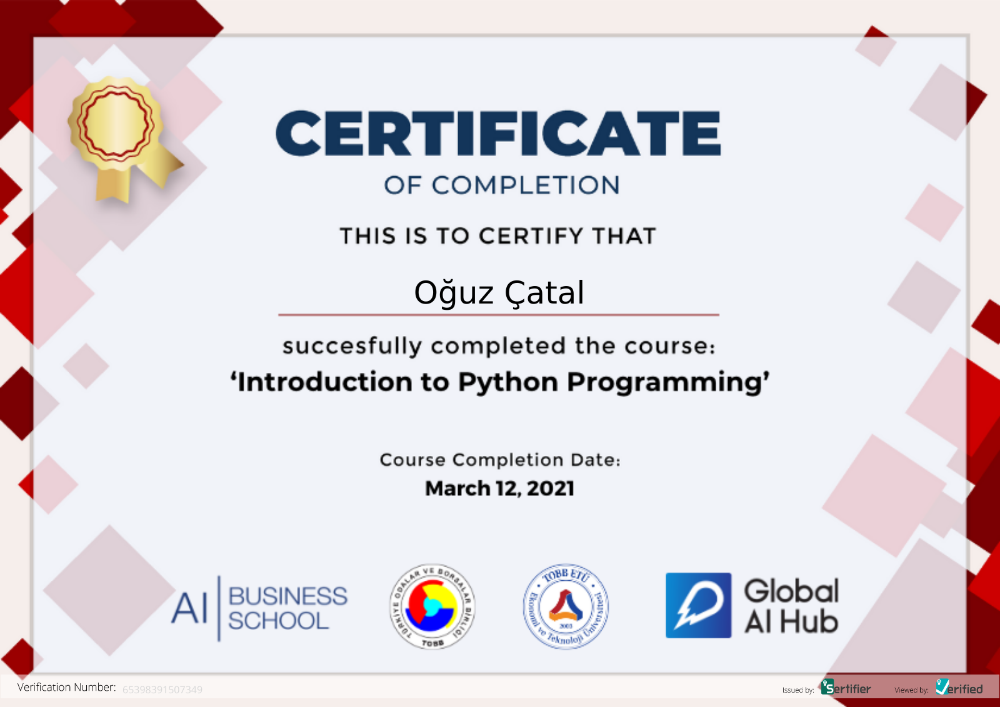

# GAIH Student Repo


**Course Date:** 08.03.2021  
**Name:** Oğuz  
**Surname:** Çatal  
**Email:** oguzcatal@gmail.com  

This repository is for holding information about homeworks and project of Global AI Hub - "Introduction to Python Programming Course". Descriptions of the project are elaborated below.

## Paying You!
This is a knowledge contest. simply, it includes 10 questions which are chosen by randomly from the source and have only one correct answer. In the end contestant is deemed successful or not according the amount of correct answer(>5).

## Requirements
The source file for questions is avaliable to download in /Final Project. Alternatively, you can choose another source for questions if you wish.
```
import pandas as pd
import random

```
---

### Certification


